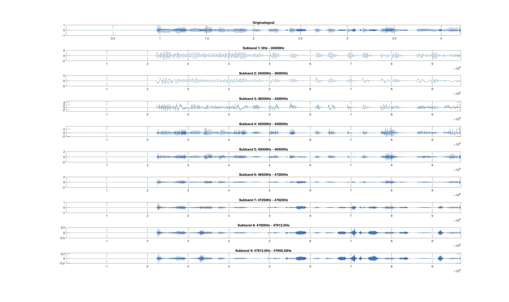

# WaveletPlayground

I wanted to play around with the wavelet transformation in Matlab without neither the need to go in-depth first and implement it myself, nor buy the Wavelet Toolbox. As I found no suitable and easy-to-understand open-source MATLAB implementations out of the box, but [a small C++ Library containing a some wavelet transformation routines](http://wavelet2d.sourceforge.net) I decided to build a mex based wrapper to call those routines from Matlab. Needs some helper functions to check the Arguments supplied to the functions from another repo I maintain - this is linked as a submodule, make sure to dowload it too.

All C-Code was modified to compile on Mac OS and not checked for cross-plattform compatibility.

